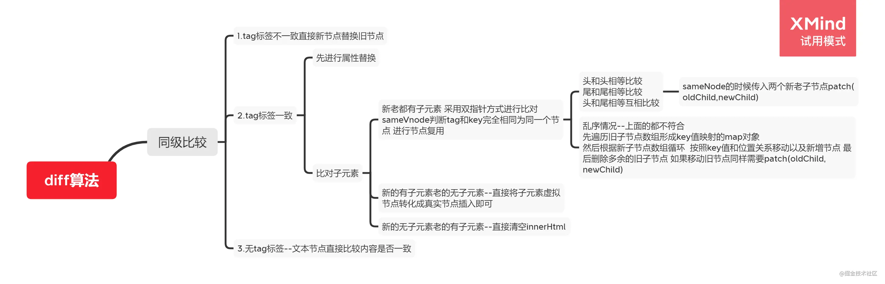
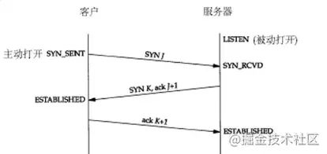
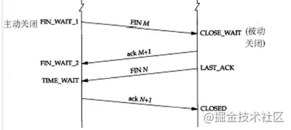

# 总览

## html

### 行内元素 / 块级元素举例

- 行内元素：img input span b i 
- 块级元素：div ul li ol h p

### src / href 区别

- src：
- href：

### iframe 优缺点

- 优点：可以在页面中打开另一页面 ， 并且可以通讯 
- 缺点：可能会阻塞页面，某些移动版本不支持

## css

### bfc

1. 含义：块级格式化上下文
2. 特性：
   - 一个隔离的容器
   - box靠左上下排列
   - 浮动元素不能再bfc容器上方浮动
   - bfc内部浮动元素也参与高度的计算
3. 创建：
   - overflow：不为visible
   - display：flex 、 table  、 inline-block
   - float：值不是none
   - position：值不是static releative
4. 作用：
   - 清除浮动
   - 外边距塌陷

### c3 新特性

- border-radius
- box-shadow
- 渐变效果
- box-sizing
- transition
- transform
- nth-child()
- last-child
- not()

### 继承属性

继承

- color
- font-size
- font-family
- line-height

不继承

- height
- width
- display
- background
- position

### flex

- 

### 盒模型

- 都有 margin border padding container
- 基本盒模型：width = container
- IE盒模型：width = container + padding + border 

### 回流 / 重绘

- 回流：
  - 描述：浏览器计算元素的几何信息和位置的过程，回流之后会将几何信息进行重绘
  - 触发：添加删除dom，元素的位置或者大小发生变化，内容发生变化，窗口尺寸变化，获取元素位置信息时 scrollTop.scrollLeft,clientTop...
- 重绘：
  - 描述：依据回流的信息计算绝对的像素信息给与gpu绘制
  - 触发：color、background-color

### 定位

- static
- releative：相对于自身定位
- absolute：相对于父元素的定位元素，否则时浏览器
- fixed：浏览器
- sticky：在正常文档流中

### inline 回车

- 修改父元素 `font-szie：0`

### 居中方法

- position：absolute；top:50%；left:50%；transform:translate(-50%,-50%)
- flex：align-items:center；justify-content:center
- text-align：center；line-height:height

## js

### 数据类型

- 基本数据类型
  - number、string、boolean、null、undefined、symbol
- 引用类型
  - array、object、function

### 计算元素是否可视

- **Element.getBoundingClientRect()** : 相对于client计算对应的距离
- **InterSectionObserver(callback,options)**

### 0.1+0.2

- js的浮点数运算，转二进制时整数部分除二取余，小数部分乘二取整导致0.1，0.2的转化为无线循环，因为js只保存52为浮点数，最后0舍1进
- 解决：
  - 小数转整数运算
  - 保留小数：toFixed()
  - math.js

### 类型检测

- typeof：基本类型检测以及部分引用类型
  - array，null会被检测为object
  - NaN/Infinity 检测为 number
- instanceOf：引用类型检测
  - 无法检测基本类型
  - 引用类型检测为Object都是true
- **Object.prototype.toString.call()**
  - 无法检测自己创建的类型

### 类型转换

- boolean：条件运算
- string：在+ 运算当中，且有一方为string
- number：比较操作，算数操作（+另算）
- == ：
  - 先转换为相同类型，在比较
  - null == undefined = true
  - obj == obj = 比较地址
  - obj == string = 转换为string在比较
  - NaN与任何都不相等
  - 除了以上情况，都先转为number在比较
- 总结：bsn转换，等于转换异常之后是number

### 拷贝

- 浅拷贝
  - =
  - Obejct.assign
  - ...
  - concat
  - slice
- 深拷贝
  - JSON.parse(JSON.strtify()) : function，undefined，symbol丢失
  - 递归
  - lodash/deepClone

### let const var

### 箭头函数

- 箭头函数是es6的函数的简便写法
- 区别
  - 他的this指向父级作用域
  - this无法被 call apply bind 修改
  - 不能作为构造函数
  - 没有prototype属性
  - 没有arguments参数 可以使用 ...args替代
  - 不能使用 new 调用

### this

### 扩展运算符

### proxy

- Object.definedPrototy
  - 缺点：无法监听数组，只能监听对象的属性
- proxy
  - 直接监听对象，数组
  - 多种拦截方法

### import require

- import
  - 是es6新增的方法
  - 会自动提升到顶部
  - 他是静态的
  - 是异步的
- require
  - node自带的
  - 可以在任何地方调用
  - 是一个函数
  - 是同步的

### 数组

- arguments
- 方法
- 遍历

	- for...in / for...of

### ajax

- 基于XMLHttpRequest

### 原型链

- 定义：js对象有prototype属性意为原型，原型也有自己的prototype，最后形成原型链
- 作用
  - 当调用属性或者方法时如果当前对象没有那么会在原型链上进行查找，用于方法的继承调用
  - 原型链的最上层是null,null的上一层是Object.prototype
  - `__proto__`指向对象的原型链
  - Object.creacte(obj) 为创建的对象指定原型
  - Object.setPrototypeOf(obj,prototype) 把obj的prototype设为prototype
  - 如果构造函数有输出则要输出构造函数的输出

### 闭包

- 含义：一个可以使用其他函数作用域中的参数的函数，因为变量被引用导致变量无法被回收，可以实现变量的公共利用
- 作用
  - 实现柯里化
  - 防抖节流函数
  - 。。。

### promise

### event loop

- js的任务被分为 宏任务及微任务
- 宏任务：settimeout 、setInterval、 I/O 、UI Render
- 微任务：promise.then 、process.nextTick 、MutationObserver
- 同步任务运行结束会将相应的宏任务及微任务放置到任务队列中，优先执行微任务其次执行宏任务

### 内存回收及泄露

### 大文件上传

- blob.slice 切片

### workers

### js 方法

## vue

### 原理

### Object.definePrototype / proxy 

- 使用 Object.definedPrototype 拦截数据的读取，将data转换为observer，在get中收集依赖添加到dep依赖收集器中。当数据改变触发set方法，会触发dep的notify方法通知weather去调用相应的weather.update方法进行实例跟新
- Object.defindPrototype的缺点
  - 无法代理数组
  - 只能代理对象的属性
- proxy
  - 可以代理数组，且直接代理对象
  - 触发的方式很多

### mvc / mvvm

- mvc
  - model：数据
  - view：视图
  - controler：控制器
  - model负责当数据改变时通知view进行渲染，view通过触发controler修改model
  - model与view层通过观察者模式链接，view和control层通过策略模式响应
- mvvm
  - model：数据
  - view：渲染视图
  - modelview：桥梁
  - 当model修改时通知vm，vm跟新view的数据，view进行重新渲染。view修改了数据，通知vm，vm操作model修改数据

### vue / react 比较

- 相同
  - 使用了虚拟dom
  - 都是响应式
  - 推崇组件化开发
- 不同
  - vue是双向数据流，react推崇单向数据流
  - vue有自己的模板语法，react使用jsx
  - diff算法不同

### computed / watch

### data 为什么是函数

- 防止组建中的data的属性值会相互污染，如果是函数可以实现作用域隔离

### diff

- 比较新老节点，只进行同级比较。
- 标签不存在直接添加
- 新的节点不存在直接删除
- 标签存在但不同直接替换
- 标签相同优先比较跟新属性再对比子元素
- 新的无直接清空，老的无直接添加，都有先判断tag和key是否一致，一致表示可以复用
- 头尾相互比较相同的话比较新老节点
- 乱序情况遍历旧节点数组形成key值映射的map对象，在根据新节点数组循环，按照key值和位子关系移动以及新增节点，最后删除多余的子节点



### v-for / v-if

### $nextTick

### 数组方法

### spa / mpa

- - 

### mixins / vuex / 组件 操作数据区别

- vuex 
  - 一对多
  - 修改之后其他引用全部修改
- mixins
  - 数据相互不影响
- 组件
  - 数据修改组件也会相应修改

### 路由守卫

生命周期

- beforeRouteLeave 
  - 组件离开守卫，可以阻止页面的返回但是无法阻止浏览器返回
- beforeEach
  - 全局前置守卫，可以用来鉴权
- beforeRouteUpdate
  - 组件跟新守卫，当路由切换但是有复用组件时会先调用
- beforeEnter
  - 路由独享守卫，可以为单个路由添加enter守卫
  - 不会在params，query，hash改变时触发
  - 方法可以是数组 `beforeEnter:[fn1,fn2]`
- beforeRouteEnter
  - 组件进入守卫，在导航确认前调用
  - 无法访问this，但是可以通过`next(vm => ...)`访问修改this

- beforeResolve
  - 全局解析守卫，导航确认前，组件守卫及路由独享守卫解析之后调用
- afterEach
  - 全局后置钩子
  - 没有next参数

钩子参数

- to：进入的路由
- from：前往的路由
- next()：
  - false ：终止当前导航，如果浏览器URL变化则会跳转到from
  - path | '/' ：跳转到其他路由
  - next()：直接进入目标路由

传参

- query
  - 一直存在
- params
  - 刷新消失
- 动态路由 params
  - 拼接路由
  - 刷新存在

包含的组件

- router-link
- router-view
- keep-alive

route与router区别

- route：是路由的信息参数
- router：是路由的实例

懒加载

- component:() => import('../views/...vue')

重定向

- redirect: '/'
- redirect: path
- redirect: to => {}

meta : 路由携带信息

scroll：

- scrollBehavior 当前已取消
- 可以在afterEach中操作document.body.scrollTop

模式

- html：

  - createWebHistory

  - 路由正常

  - 需要配置服务器nginx

  - ```
    location / {
      try_files $uri $uri/ /index.html;
    }
    ```

- hash：

  - createWebHashHistory
  - SEO不友好
  - URL中有#号

## 浏览器

### TCP 三次握手

- 作用：确认双方的接收及发送能力是否正常

- 三次握手

  - 客户端 发送 SYN  ——> 服务端
  - 服务端 接收 SYN  返回 SYN + ACK ——>  客户端
  - 客户端 接收 SYN + ACK 返回 ACK ——> 服务端
  - 服务端 接收 ACK 建立链接
  - 

- 四次挥手

  - 客户端 发送 FIN 处于 WATI1 状态  ——> 服务端

  - 服务端 接收FIN 返回 ACK (FIN+1)  处于 FIN_CLOSE 状态 ——>  客户端

  - 客户端 发送 FIN 处于LAST_ACK 状态 ——> 客户端

  - 客户端 返回 ACK (FIN+1) 处于TIME_WAIT 状态 ——> 服务端

  - 服务端 接收 ACK 等待片刻 处于CLOSE 状态

  - 

    

### 缓存

- 强缓存
  - 
- 协商缓存

### url解析流程

- 本地查看hosts
- DNS解析地址
- 发起TCP链接
- 发送HTTP请求
- 接收返回的数据交由浏览器渲染

### 浏览器渲染

- 解析HTML文件，生成DOM树
- 解析CSS文件生成CSSOM树
- 合并DOM树和CSSOM树生成渲染树
- 回流计算元素的几何信息及位置信息
- 重绘根据回流的数据生成元素的绝对像素信息
- 交由GPU渲染

## axios

- node : http
- browse：XMLHttpRequest

## webpack

## 优化

## 其他

首屏时间计算

### 打包分析

### CND

### 压缩

## 手写代码

### new

### call / bind / apply

### 防抖 / 节流

## 算法

### 质数

## 设计模式

## 简历

## 工作经历

